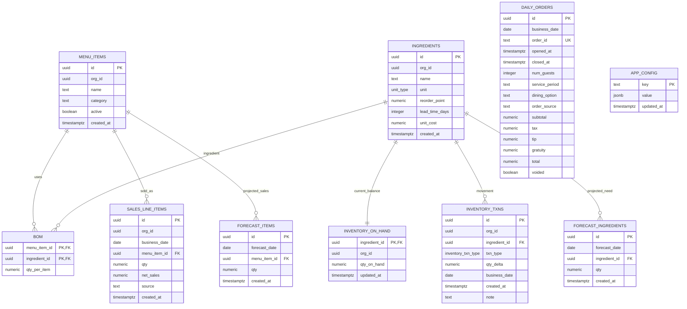

# Stockd Data Model

## Source of truth

The schema source of truth is the Supabase migration set under `supabase/migrations/`. The most important files are:

- `20260207000100_init_schema.sql`
- `20260207000200_consumption_engine.sql`
- `20260207000300_onboarding_and_bulk_close.sql`
- `20260207000500_forecasting_v1.sql`
- `20260207000700_daily_orders_and_analytics.sql`
- `20260207000800_admin_crud_rpcs.sql`
- `20260207000900_register_order_rpc.sql`

`supabase/seed.sql` only creates a minimal local seed record. It is not representative of the full Stockd demo dataset.

## Data model at a glance

## Enums

Defined in `supabase/migrations/20260207000100_init_schema.sql`:

### `unit_type`

Allowed values:

- `g`
- `oz`
- `lb`
- `each`

### `inventory_txn_type`

Allowed values:

- `RECEIVE`
- `COUNT`
- `CONSUME`

Notably absent:

- no dedicated `WASTE`
- no `TRANSFER`
- no `ADJUSTMENT` beyond count
- no purchase-order or invoice status enums

## Table-by-table detail

### `menu_items`

Purpose:

- master list of sellable menu items

Columns:

- `id uuid primary key default gen_random_uuid()`
- `org_id uuid`
- `name text not null`
- `category text`
- `active boolean not null default true`
- `created_at timestamptz not null default now()`

Relationships:

- referenced by `bom.menu_item_id`
- referenced by `sales_line_items.menu_item_id`
- referenced by `forecast_items.menu_item_id`

Constraints and indexes:

- primary key on `id`
- no unique constraint on `name`
- active flag is used by kiosk and UI reads

Notes:

- menu items do not have a stored price column
- this is why the kiosk hardcodes a flat item price in `kiosk/kiosk.js`
- dynamic pricing cannot be fully implemented against this schema as-is

### `ingredients`

Purpose:

- master ingredient catalog

Columns:

- `id uuid primary key default gen_random_uuid()`
- `org_id uuid`
- `name text not null`
- `unit unit_type not null`
- `reorder_point numeric(12,3) not null default 0`
- `lead_time_days integer not null default 0`
- `unit_cost numeric(12,4) not null default 0`
- `created_at timestamptz not null default now()`

Relationships:

- referenced by `bom.ingredient_id`
- referenced by `inventory_on_hand.ingredient_id`
- referenced by `inventory_txns.ingredient_id`
- referenced by `forecast_ingredients.ingredient_id`

Notes:

- ingredient name is not unique
- reorder and lead-time fields are used by `get_inventory_snapshot()`
- `unit_cost` is used in BOM-cost calculations but not widely surfaced in the frontend

### `bom`

Purpose:

- bill of materials linking menu items to ingredients

Columns:

- `menu_item_id uuid not null`
- `ingredient_id uuid not null`
- `qty_per_item numeric(12,3) not null`

Relationships:

- many-to-many bridge between `menu_items` and `ingredients`

Constraints and indexes:

- composite primary key `(menu_item_id, ingredient_id)`
- `menu_item_id` references `menu_items(id)` with `on delete cascade`
- `ingredient_id` references `ingredients(id)` with `on delete restrict`
- index on `ingredient_id`

Notes:

- this table is the backbone of inventory consumption and ingredient forecasting
- missing BOM rows mean sales can be recorded without inventory consumption

### `sales_line_items`

Purpose:

- daily aggregated sales by menu item, not true order-line grain

Columns:

- `id uuid primary key default gen_random_uuid()`
- `org_id uuid`
- `business_date date not null`
- `menu_item_id uuid not null`
- `qty numeric(12,3) not null`
- `net_sales numeric(12,2) not null default 0`
- `source text`
- `created_at timestamptz not null default now()`

Relationships:

- `menu_item_id` references `menu_items(id)`

Constraints and indexes:

- unique index on `(business_date, menu_item_id)`
- index on `business_date`

How it is populated:

- `ingest_daily_sales()` replaces totals for a given day/item pair
- `register_order()` adds to existing totals for a given day/item pair

Notes:

- Because this is aggregated by day and item, not order line, some "top seller" or "live order" interpretations are limited.
- Copilot prompt text explicitly warns that this is daily aggregated data. Evidence: `supabase/functions/copilot/prompts.ts`.

### `inventory_on_hand`

Purpose:

- mutable current inventory snapshot per ingredient

Columns:

- `ingredient_id uuid primary key`
- `org_id uuid`
- `qty_on_hand numeric(12,3) not null default 0`
- `updated_at timestamptz not null default now()`

Relationships:

- `ingredient_id` references `ingredients(id)` with `on delete cascade`

Notes:

- this is derived state
- it is mutated by `run_daily_close()`, `run_bulk_close()`, `receive_inventory()`, `count_inventory()`, and `register_order()`
- `inventory_txns` is the more durable ledger; `inventory_on_hand` is the convenience snapshot

### `inventory_txns`

Purpose:

- immutable-ish inventory movement ledger

Columns:

- `id uuid primary key default gen_random_uuid()`
- `org_id uuid`
- `ingredient_id uuid not null`
- `txn_type inventory_txn_type not null`
- `qty_delta numeric(12,3) not null`
- `business_date date` (added later in `20260207000200_consumption_engine.sql`)
- `created_at timestamptz not null default now()`
- `note text`

Relationships:

- `ingredient_id` references `ingredients(id)` with `on delete restrict`

Constraints and indexes:

- index on `(ingredient_id, created_at desc)`
- index on `business_date`

Meaning:

- `RECEIVE`: increases stock
- `COUNT`: sets stock via delta against previous on-hand
- `CONSUME`: decreases stock based on sales and BOM

Notes:

- There is no dedicated waste/shrinkage transaction type.
- Some waste could be inferred from negative count deltas, but the model does not distinguish cause.

### `app_config`

Purpose:

- generic key-value configuration table

Columns:

- `key text primary key`
- `value jsonb not null default '{}'`
- `updated_at timestamptz not null default now()`

Current usage:

- a single `onboarding` row that stores `setup_complete`, `history_uploaded`, dates, row counts, and completion status

Notes:

- this is global, not tenant-specific
- onboarding state is therefore modeled as single-app state, not per restaurant/org

### `forecast_items`

Purpose:

- cached/generated per-day menu item forecast quantities

Columns:

- `id uuid primary key default gen_random_uuid()`
- `forecast_date date not null`
- `menu_item_id uuid not null`
- `qty numeric(12,3) not null default 0`
- `created_at timestamptz not null default now()`

Constraints and indexes:

- unique `(forecast_date, menu_item_id)`
- index on `forecast_date`

Notes:

- generated by `generate_forecast()`
- currently not consumed cleanly by the main dashboard UI

### `forecast_ingredients`

Purpose:

- cached/generated per-day ingredient forecast quantities

Columns:

- `id uuid primary key default gen_random_uuid()`
- `forecast_date date not null`
- `ingredient_id uuid not null`
- `qty numeric(12,3) not null default 0`
- `created_at timestamptz not null default now()`

Constraints and indexes:

- unique `(forecast_date, ingredient_id)`
- index on `forecast_date`

Notes:

- this is what `get_forecast()` actually exposes
- it is the most "real" forecast surface in the repo today

### `daily_orders`

Purpose:

- order-level analytics table, supplementary to `sales_line_items`

Columns:

- `id uuid primary key default gen_random_uuid()`
- `business_date date not null`
- `order_id text not null`
- `opened_at timestamptz`
- `closed_at timestamptz`
- `num_guests integer default 0`
- `server_name text`
- `dining_area text`
- `service_period text`
- `dining_option text`
- `order_source text`
- `discount_amount numeric(10,2) default 0`
- `subtotal numeric(10,2) default 0`
- `tax numeric(10,4) default 0`
- `tip numeric(10,2) default 0`
- `gratuity numeric(10,2) default 0`
- `total numeric(10,2) default 0`
- `voided boolean default false`
- `created_at timestamptz default now()`

Constraints and indexes:

- unique constraint on `order_id`
- index on `business_date`
- index on `service_period`

How it is populated:

- `ingest_daily_orders()` from CSV or scripts
- `register_order()` from kiosk / live order flow
- `scripts/generate-daily-orders.js` can synthesize it from historical `sales_line_items`

Notes:

- `daily_orders` has no `org_id`
- it also has no foreign key to `sales_line_items`
- some frontend code still expects `order_time` / `order_hour`, but the schema uses `opened_at`

## Relationships and derived state

Core relationship chain:

1. `menu_items` describes sellable products.
2. `ingredients` describes stock items.
3. `bom` maps menu items to ingredients.
4. `sales_line_items` records demand by day and menu item.
5. `inventory_txns` records consumption, receive, and count deltas.
6. `inventory_on_hand` stores the current balance per ingredient.
7. `forecast_items` and `forecast_ingredients` project future demand.
8. `daily_orders` supports richer analytics than `sales_line_items` can provide.

Most important derived tables:

- `inventory_on_hand` is a mutable derived balance
- `forecast_items` is regenerable derived forecast state
- `forecast_ingredients` is regenerable derived forecast state

Most important ledger/event tables:

- `sales_line_items`
- `inventory_txns`
- `daily_orders`

## Constraints and integrity observations

Strengths:

- core foreign keys are present
- BOM has a good composite key
- forecast tables prevent duplicate forecast rows per date/entity
- `daily_orders.order_id` enforces order idempotency

Weak spots:

- `menu_items.name` and `ingredients.name` are not unique
- `org_id` is not enforced relationally or via policy
- `daily_orders` is not linked to tenant/org or line-item detail
- no vendor, invoice, price history, waste, or alert tables exist

## Inventory-specific modeling notes

What works well:

- BOM-based ingredient consumption
- explicit receive and count transaction trail
- snapshot plus ledger design

What is missing:

- waste/spoilage classification
- lot/batch/expiry tracking
- vendor/purchase-order/invoice persistence
- storage-location modeling

## Forecasting-specific modeling notes

What exists:

- daily forecast by menu item and ingredient
- shortfall logic via `get_forecast()`

What is missing:

- confidence intervals
- actual-vs-forecast history table
- forecast accuracy history table
- seasonality or special-event dimensions

## Pricing-specific modeling notes

What exists:

- sales revenue totals in `sales_line_items.net_sales`
- order totals in `daily_orders`
- advisory pricing recommendations in the Copilot path

What is missing:

- current menu item price field
- price history/versioning table
- dynamic pricing events or rules table
- any persisted link between pricing recommendations and actual pricing changes

## Important schema gaps for future requirements

Missing first-class entities include:

- organizations / restaurants
- users, roles, or memberships beyond Supabase Auth
- waste / spoilage events
- vendors / suppliers
- purchase orders
- invoice records
- alerts / notifications
- reports / exports
- menu price history

## Recommended next steps

1. Decide whether `org_id` is real future scope or leftover scaffolding.
2. Add missing first-class entities before building features that currently rely on demo assumptions.
3. Preserve the strong event/snapshot pattern for inventory, but extend it with explicit waste and purchasing models.

